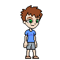
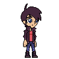
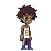

    </img>
     
    </img></img></img>

## A character creator for pixel art enthusiasts.

**Technologies**: C++, Qt

**Developer**: Wayne (Yip Wen Qian)

**Contact**: yipw@usc.edu

## Current Features

- Parse source images and icons 
- Customize body parts and clothing
- Randomly assign body parts and clothing
- Change colors of body parts
- Save avatar to drive

## Installation

[To be added]
